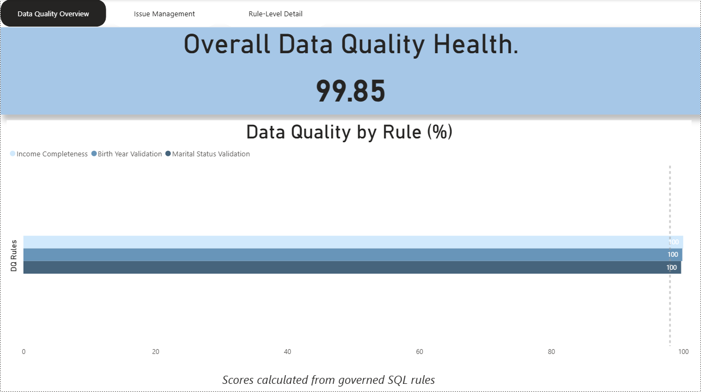
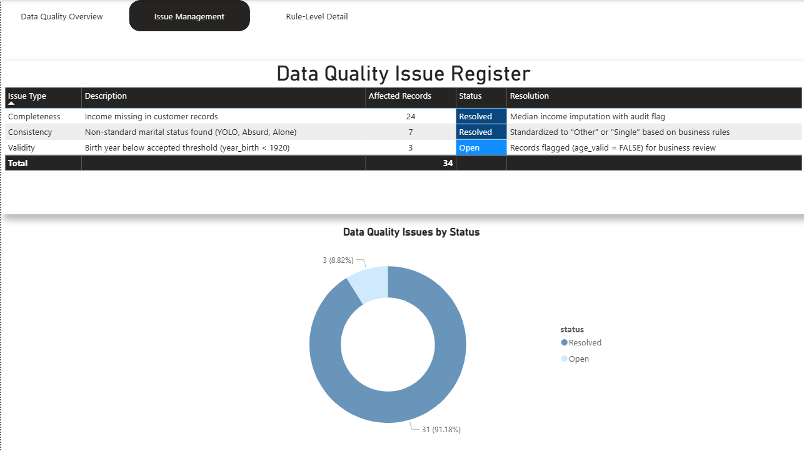
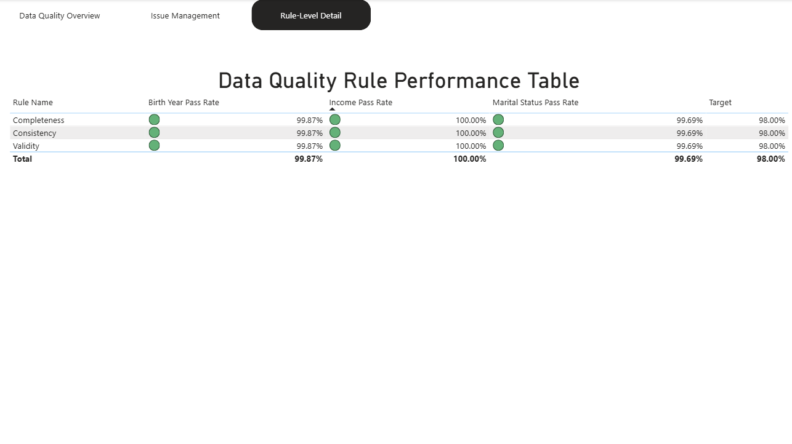

# Customer Master Data Quality & Stewardship Project

## Project Overview

This project demonstrates an **end-to-end Data Steward workflow** focused on improving and governing **Customer Master Data Quality**.
It covers data profiling, data quality rule definition, issue management, metadata documentation, automation, and executive reporting.

The goal is to ensure customer data is **accurate, complete, consistent, and fit for business use**, while clearly showing how a Data Steward adds value beyond analytics.

---

## Business Problem

Customer master data is widely used across Marketing, Sales, and Finance.
However, poor data quality can lead to:

* Incorrect customer segmentation
* Misleading revenue insights
* Compliance and reporting risks
* Loss of trust in data

This project addresses these challenges by implementing **data quality controls, governance artifacts, and monitoring dashboards**.

---

## Dataset

* **Source:** Customer Personality Analysis dataset (Kaggle)
* **Domain:** Customer demographics and purchasing behavior
* **Records:** 2,240 customers

---

## Project Objectives

* Profile customer data to identify quality issues
* Define business-driven data quality rules
* Implement technical checks using SQL
* Log and manage data quality issues
* Create governance documentation (metadata)
* Automate reporting using Python
* Visualize data quality metrics in Power BI

---

## Data Quality Dimensions Covered

* **Completeness** – Missing income values
* **Validity** – Invalid birth years
* **Uniqueness** – Customer ID uniqueness
* **Consistency** – Standardized marital status values

---

## Project Architecture

```
PostgreSQL (Source of Truth)
        ↓
SQL Profiling & Rule Checks
        ↓
Python Automation (Exports & Reports)
        ↓
Governance Artifacts (Excel)
        ↓
Power BI Dashboards
```

---

## Folder Structure

```
Customer_Data_Steward_Project/
│
├── sql/
│   ├── 01_data_profiling.sql
│   ├── 02_data_cleaning_customers.sql
│   └── 03_data_quality_rules_and_scoring.sql
│
├── python/
│   ├── dq_reporting_export.py
│   └── dq_governance_export.py
│
├── governance/
│   ├── business_glossary.xlsx
│   ├── data_dictionary.xlsx
│   ├── dq_rules.xlsx
│   └── issue_register.xlsx
│
├── powerbi/
│   ├── dq_dashboard.pbix
│   └── dashboard_screenshots/
│
└── README.md
```

---

## Key Deliverables

### 1. Data Profiling

* Null analysis
* Duplicate detection
* Range and outlier checks
* Categorical value consistency

### 2. Data Quality Rules

Examples:

* Income must not be NULL
* Customer birth year must be ≥ 1920
* Customer ID must be unique
* Marital status must follow standardized values

### 3. Data Quality Scoring

* Rule-level quality percentages
* Overall Data Quality Score
* Summary view (`dq_summary`) for reporting

---

## Issue Management

All identified issues are logged in a **Data Quality Issue Register** including:

* Issue type
* Description
* Number of affected records
* Resolution approach
* Status (Open / Resolved)

This reflects a real-world stewardship process.

---

## Governance & Metadata

The project includes formal governance artifacts:

* **Business Glossary** – Business definitions and ownership
* **Data Dictionary** – Technical metadata
* **Data Quality Rule Book** – Business expectations
* **Issue Register** – Data quality incident tracking

These artifacts ensure consistency, accountability, and transparency.

---

## Automation Using Python

Python is used to:

* Connect to PostgreSQL
* Extract validated data quality tables
* Export governance artifacts to Excel
* Generate automated data quality reports

This removes manual effort and supports repeatable governance processes.

---

## Power BI Data Quality Dashboard

### Page 1 – Executive Summary


This page provides a high-level view of overall data quality health,
including overall DQ score, rule pass rates, and record counts.

### Page 2 – Data Quality Issues


Tracks open vs resolved data quality issues and affected records,
supporting stewardship and governance decisions.

### Page 3 – Rule-Level Analysis


Shows individual data quality rule performance and highlights
columns with the highest failure rates.


## Tools & Technologies

* **Database:** PostgreSQL
* **SQL:** Data profiling, rule checks, scoring
* **Python:** pandas, SQLAlchemy
* **Visualization:** Power BI
* **Documentation:** Excel, Markdown

---

## Key Learnings (Data Steward Perspective)

* Translating business expectations into technical rules
* Managing data quality as an ongoing process
* Balancing correction vs. auditability
* Creating trust through documentation and transparency
* Communicating data quality clearly to stakeholders

---

## Author

**Fathima Farha**
Aspiring Data Steward 


